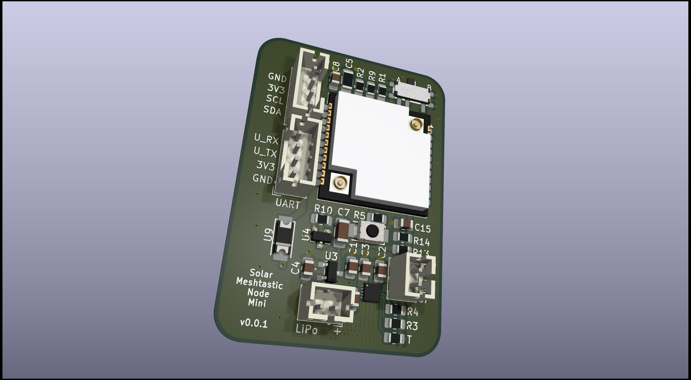

# What is this thing?

This is a miniaturized version of the [SolarMeshtasticNode](https://github.com/h0lad/SolarMeshtasticNode).

Specs are the same - with following things removed:
 - 18650 LiPo case
 - ADC circuit for VBUS removed
 - LEDs 

 Modifications
  - Add proper switch for selecting bootloader or application
  - Reset button

## Physical size

37mm x 47mm

## Hardware Verification

PCB not tested - but inherited from tested SolarMeshtasticNode.

 ## License

CERN OHL v2 – Strongly Reciprocal (S)